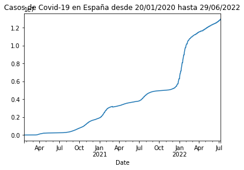
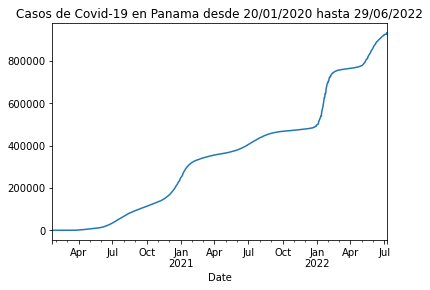
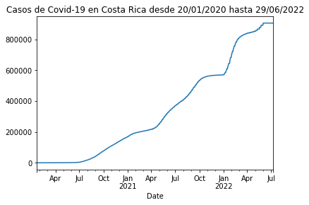
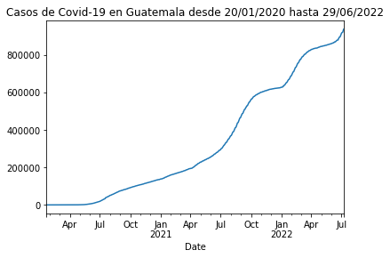
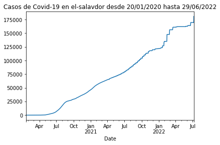
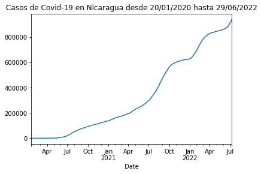
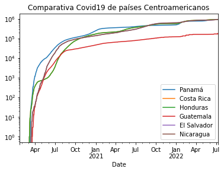

# AD4: conexión con la API del COVID-19 y análisis con Pandas

Me conecto a la API https://covid19api.com/


```python
!pip install pandas 

```

    Requirement already satisfied: pandas in c:\users\hp\anaconda3\lib\site-packages (1.4.2)
    Requirement already satisfied: numpy>=1.18.5 in c:\users\hp\anaconda3\lib\site-packages (from pandas) (1.21.5)
    Requirement already satisfied: pytz>=2020.1 in c:\users\hp\anaconda3\lib\site-packages (from pandas) (2021.3)
    Requirement already satisfied: python-dateutil>=2.8.1 in c:\users\hp\anaconda3\lib\site-packages (from pandas) (2.8.2)
    Requirement already satisfied: six>=1.5 in c:\users\hp\anaconda3\lib\site-packages (from python-dateutil>=2.8.1->pandas) (1.16.0)
    


```python
import pandas as pd

```


```python
url = 'https://api.covid19api.com/countries'

```


```python
url
```


    'https://api.covid19api.com/countries'


```python
df = pd.read_json(url)
```


```python
df
```


<div>
<style scoped>
    .dataframe tbody tr th:only-of-type {
        vertical-align: middle;
    }

    .dataframe tbody tr th {
        vertical-align: top;
    }

    .dataframe thead th {
        text-align: right;
    }
</style>
<table border="1" class="dataframe">
  <thead>
    <tr style="text-align: right;">
      <th></th>
      <th>Country</th>
      <th>Slug</th>
      <th>ISO2</th>
    </tr>
  </thead>
  <tbody>
    <tr>
      <th>0</th>
      <td>Gibraltar</td>
      <td>gibraltar</td>
      <td>GI</td>
    </tr>
    <tr>
      <th>1</th>
      <td>Oman</td>
      <td>oman</td>
      <td>OM</td>
    </tr>
    <tr>
      <th>2</th>
      <td>France</td>
      <td>france</td>
      <td>FR</td>
    </tr>
    <tr>
      <th>3</th>
      <td>Jersey</td>
      <td>jersey</td>
      <td>JE</td>
    </tr>
    <tr>
      <th>4</th>
      <td>Mali</td>
      <td>mali</td>
      <td>ML</td>
    </tr>
    <tr>
      <th>...</th>
      <td>...</td>
      <td>...</td>
      <td>...</td>
    </tr>
    <tr>
      <th>243</th>
      <td>Puerto Rico</td>
      <td>puerto-rico</td>
      <td>PR</td>
    </tr>
    <tr>
      <th>244</th>
      <td>Papua New Guinea</td>
      <td>papua-new-guinea</td>
      <td>PG</td>
    </tr>
    <tr>
      <th>245</th>
      <td>Saint Pierre and Miquelon</td>
      <td>saint-pierre-and-miquelon</td>
      <td>PM</td>
    </tr>
    <tr>
      <th>246</th>
      <td>Timor-Leste</td>
      <td>timor-leste</td>
      <td>TL</td>
    </tr>
    <tr>
      <th>247</th>
      <td>Montenegro</td>
      <td>montenegro</td>
      <td>ME</td>
    </tr>
  </tbody>
</table>
<p>248 rows × 3 columns</p>
</div>


```python
df[df['Country'] == 'Spain']
```


<div>
<style scoped>
    .dataframe tbody tr th:only-of-type {
        vertical-align: middle;
    }

    .dataframe tbody tr th {
        vertical-align: top;
    }

    .dataframe thead th {
        text-align: right;
    }
</style>
<table border="1" class="dataframe">
  <thead>
    <tr style="text-align: right;">
      <th></th>
      <th>Country</th>
      <th>Slug</th>
      <th>ISO2</th>
    </tr>
  </thead>
  <tbody>
    <tr>
      <th>141</th>
      <td>Spain</td>
      <td>spain</td>
      <td>ES</td>
    </tr>
  </tbody>
</table>
</div>


```python
url_rt_es = 'https://api.covid19api.com/country/spain/status/confirmed/live'
df_rt_es = pd.read_json(url_rt_es)
df_rt_es
```


<div>
<style scoped>
    .dataframe tbody tr th:only-of-type {
        vertical-align: middle;
    }

    .dataframe tbody tr th {
        vertical-align: top;
    }

    .dataframe thead th {
        text-align: right;
    }
</style>
<table border="1" class="dataframe">
  <thead>
    <tr style="text-align: right;">
      <th></th>
      <th>Country</th>
      <th>CountryCode</th>
      <th>Province</th>
      <th>City</th>
      <th>CityCode</th>
      <th>Lat</th>
      <th>Lon</th>
      <th>Cases</th>
      <th>Status</th>
      <th>Date</th>
    </tr>
  </thead>
  <tbody>
    <tr>
      <th>0</th>
      <td>Spain</td>
      <td>ES</td>
      <td></td>
      <td></td>
      <td></td>
      <td>40.46</td>
      <td>-3.75</td>
      <td>0</td>
      <td>confirmed</td>
      <td>2020-01-22 00:00:00+00:00</td>
    </tr>
    <tr>
      <th>1</th>
      <td>Spain</td>
      <td>ES</td>
      <td></td>
      <td></td>
      <td></td>
      <td>40.46</td>
      <td>-3.75</td>
      <td>0</td>
      <td>confirmed</td>
      <td>2020-01-23 00:00:00+00:00</td>
    </tr>
    <tr>
      <th>2</th>
      <td>Spain</td>
      <td>ES</td>
      <td></td>
      <td></td>
      <td></td>
      <td>40.46</td>
      <td>-3.75</td>
      <td>0</td>
      <td>confirmed</td>
      <td>2020-01-24 00:00:00+00:00</td>
    </tr>
    <tr>
      <th>3</th>
      <td>Spain</td>
      <td>ES</td>
      <td></td>
      <td></td>
      <td></td>
      <td>40.46</td>
      <td>-3.75</td>
      <td>0</td>
      <td>confirmed</td>
      <td>2020-01-25 00:00:00+00:00</td>
    </tr>
    <tr>
      <th>4</th>
      <td>Spain</td>
      <td>ES</td>
      <td></td>
      <td></td>
      <td></td>
      <td>40.46</td>
      <td>-3.75</td>
      <td>0</td>
      <td>confirmed</td>
      <td>2020-01-26 00:00:00+00:00</td>
    </tr>
    <tr>
      <th>...</th>
      <td>...</td>
      <td>...</td>
      <td>...</td>
      <td>...</td>
      <td>...</td>
      <td>...</td>
      <td>...</td>
      <td>...</td>
      <td>...</td>
      <td>...</td>
    </tr>
    <tr>
      <th>894</th>
      <td>Spain</td>
      <td>ES</td>
      <td></td>
      <td></td>
      <td></td>
      <td>40.46</td>
      <td>-3.75</td>
      <td>12818184</td>
      <td>confirmed</td>
      <td>2022-07-04 00:00:00+00:00</td>
    </tr>
    <tr>
      <th>895</th>
      <td>Spain</td>
      <td>ES</td>
      <td></td>
      <td></td>
      <td></td>
      <td>40.46</td>
      <td>-3.75</td>
      <td>12890002</td>
      <td>confirmed</td>
      <td>2022-07-05 00:00:00+00:00</td>
    </tr>
    <tr>
      <th>896</th>
      <td>Spain</td>
      <td>ES</td>
      <td></td>
      <td></td>
      <td></td>
      <td>40.46</td>
      <td>-3.75</td>
      <td>12890002</td>
      <td>confirmed</td>
      <td>2022-07-06 00:00:00+00:00</td>
    </tr>
    <tr>
      <th>897</th>
      <td>Spain</td>
      <td>ES</td>
      <td></td>
      <td></td>
      <td></td>
      <td>40.46</td>
      <td>-3.75</td>
      <td>12890002</td>
      <td>confirmed</td>
      <td>2022-07-07 00:00:00+00:00</td>
    </tr>
    <tr>
      <th>898</th>
      <td>Spain</td>
      <td>ES</td>
      <td></td>
      <td></td>
      <td></td>
      <td>40.46</td>
      <td>-3.75</td>
      <td>12973615</td>
      <td>confirmed</td>
      <td>2022-07-08 00:00:00+00:00</td>
    </tr>
  </tbody>
</table>
<p>899 rows × 10 columns</p>
</div>


```python
df_rt_es.head()
```


<div>
<style scoped>
    .dataframe tbody tr th:only-of-type {
        vertical-align: middle;
    }

    .dataframe tbody tr th {
        vertical-align: top;
    }

    .dataframe thead th {
        text-align: right;
    }
</style>
<table border="1" class="dataframe">
  <thead>
    <tr style="text-align: right;">
      <th></th>
      <th>Country</th>
      <th>CountryCode</th>
      <th>Province</th>
      <th>City</th>
      <th>CityCode</th>
      <th>Lat</th>
      <th>Lon</th>
      <th>Cases</th>
      <th>Status</th>
      <th>Date</th>
    </tr>
  </thead>
  <tbody>
    <tr>
      <th>0</th>
      <td>Spain</td>
      <td>ES</td>
      <td></td>
      <td></td>
      <td></td>
      <td>40.46</td>
      <td>-3.75</td>
      <td>0</td>
      <td>confirmed</td>
      <td>2020-01-22 00:00:00+00:00</td>
    </tr>
    <tr>
      <th>1</th>
      <td>Spain</td>
      <td>ES</td>
      <td></td>
      <td></td>
      <td></td>
      <td>40.46</td>
      <td>-3.75</td>
      <td>0</td>
      <td>confirmed</td>
      <td>2020-01-23 00:00:00+00:00</td>
    </tr>
    <tr>
      <th>2</th>
      <td>Spain</td>
      <td>ES</td>
      <td></td>
      <td></td>
      <td></td>
      <td>40.46</td>
      <td>-3.75</td>
      <td>0</td>
      <td>confirmed</td>
      <td>2020-01-24 00:00:00+00:00</td>
    </tr>
    <tr>
      <th>3</th>
      <td>Spain</td>
      <td>ES</td>
      <td></td>
      <td></td>
      <td></td>
      <td>40.46</td>
      <td>-3.75</td>
      <td>0</td>
      <td>confirmed</td>
      <td>2020-01-25 00:00:00+00:00</td>
    </tr>
    <tr>
      <th>4</th>
      <td>Spain</td>
      <td>ES</td>
      <td></td>
      <td></td>
      <td></td>
      <td>40.46</td>
      <td>-3.75</td>
      <td>0</td>
      <td>confirmed</td>
      <td>2020-01-26 00:00:00+00:00</td>
    </tr>
  </tbody>
</table>
</div>


```python
df_rt_es.tail()
```


<div>
<style scoped>
    .dataframe tbody tr th:only-of-type {
        vertical-align: middle;
    }

    .dataframe tbody tr th {
        vertical-align: top;
    }

    .dataframe thead th {
        text-align: right;
    }
</style>
<table border="1" class="dataframe">
  <thead>
    <tr style="text-align: right;">
      <th></th>
      <th>Country</th>
      <th>CountryCode</th>
      <th>Province</th>
      <th>City</th>
      <th>CityCode</th>
      <th>Lat</th>
      <th>Lon</th>
      <th>Cases</th>
      <th>Status</th>
      <th>Date</th>
    </tr>
  </thead>
  <tbody>
    <tr>
      <th>894</th>
      <td>Spain</td>
      <td>ES</td>
      <td></td>
      <td></td>
      <td></td>
      <td>40.46</td>
      <td>-3.75</td>
      <td>12818184</td>
      <td>confirmed</td>
      <td>2022-07-04 00:00:00+00:00</td>
    </tr>
    <tr>
      <th>895</th>
      <td>Spain</td>
      <td>ES</td>
      <td></td>
      <td></td>
      <td></td>
      <td>40.46</td>
      <td>-3.75</td>
      <td>12890002</td>
      <td>confirmed</td>
      <td>2022-07-05 00:00:00+00:00</td>
    </tr>
    <tr>
      <th>896</th>
      <td>Spain</td>
      <td>ES</td>
      <td></td>
      <td></td>
      <td></td>
      <td>40.46</td>
      <td>-3.75</td>
      <td>12890002</td>
      <td>confirmed</td>
      <td>2022-07-06 00:00:00+00:00</td>
    </tr>
    <tr>
      <th>897</th>
      <td>Spain</td>
      <td>ES</td>
      <td></td>
      <td></td>
      <td></td>
      <td>40.46</td>
      <td>-3.75</td>
      <td>12890002</td>
      <td>confirmed</td>
      <td>2022-07-07 00:00:00+00:00</td>
    </tr>
    <tr>
      <th>898</th>
      <td>Spain</td>
      <td>ES</td>
      <td></td>
      <td></td>
      <td></td>
      <td>40.46</td>
      <td>-3.75</td>
      <td>12973615</td>
      <td>confirmed</td>
      <td>2022-07-08 00:00:00+00:00</td>
    </tr>
  </tbody>
</table>
</div>


```python
df.describe()
```


<div>
<style scoped>
    .dataframe tbody tr th:only-of-type {
        vertical-align: middle;
    }

    .dataframe tbody tr th {
        vertical-align: top;
    }

    .dataframe thead th {
        text-align: right;
    }
</style>
<table border="1" class="dataframe">
  <thead>
    <tr style="text-align: right;">
      <th></th>
      <th>Country</th>
      <th>Slug</th>
      <th>ISO2</th>
    </tr>
  </thead>
  <tbody>
    <tr>
      <th>count</th>
      <td>248</td>
      <td>248</td>
      <td>248</td>
    </tr>
    <tr>
      <th>unique</th>
      <td>248</td>
      <td>248</td>
      <td>248</td>
    </tr>
    <tr>
      <th>top</th>
      <td>Gibraltar</td>
      <td>gibraltar</td>
      <td>GI</td>
    </tr>
    <tr>
      <th>freq</th>
      <td>1</td>
      <td>1</td>
      <td>1</td>
    </tr>
  </tbody>
</table>
</div>


```python
plot_rt_es = df_rt_es.set_index('Date')['Cases'].plot(title="Casos de Covid-19 en España desde 20/01/2020 hasta 29/06/2022")
```


    

    


# Profesor pide repetir el proceso con Panamá


```python
df[df['Country'] == 'Pan']
```


<div>
<style scoped>
    .dataframe tbody tr th:only-of-type {
        vertical-align: middle;
    }

    .dataframe tbody tr th {
        vertical-align: top;
    }

    .dataframe thead th {
        text-align: right;
    }
</style>
<table border="1" class="dataframe">
  <thead>
    <tr style="text-align: right;">
      <th></th>
      <th>Country</th>
      <th>Slug</th>
      <th>ISO2</th>
    </tr>
  </thead>
  <tbody>
  </tbody>
</table>
</div>


```python
url_rt_pa = 'https://api.covid19api.com/country/panama/status/confirmed/live'
df_rt_pa = pd.read_json(url_rt_pa)
df_rt_pa
```


<div>
<style scoped>
    .dataframe tbody tr th:only-of-type {
        vertical-align: middle;
    }

    .dataframe tbody tr th {
        vertical-align: top;
    }

    .dataframe thead th {
        text-align: right;
    }
</style>
<table border="1" class="dataframe">
  <thead>
    <tr style="text-align: right;">
      <th></th>
      <th>Country</th>
      <th>CountryCode</th>
      <th>Province</th>
      <th>City</th>
      <th>CityCode</th>
      <th>Lat</th>
      <th>Lon</th>
      <th>Cases</th>
      <th>Status</th>
      <th>Date</th>
    </tr>
  </thead>
  <tbody>
    <tr>
      <th>0</th>
      <td>Panama</td>
      <td>PA</td>
      <td></td>
      <td></td>
      <td></td>
      <td>8.54</td>
      <td>-80.78</td>
      <td>0</td>
      <td>confirmed</td>
      <td>2020-01-22 00:00:00+00:00</td>
    </tr>
    <tr>
      <th>1</th>
      <td>Panama</td>
      <td>PA</td>
      <td></td>
      <td></td>
      <td></td>
      <td>8.54</td>
      <td>-80.78</td>
      <td>0</td>
      <td>confirmed</td>
      <td>2020-01-23 00:00:00+00:00</td>
    </tr>
    <tr>
      <th>2</th>
      <td>Panama</td>
      <td>PA</td>
      <td></td>
      <td></td>
      <td></td>
      <td>8.54</td>
      <td>-80.78</td>
      <td>0</td>
      <td>confirmed</td>
      <td>2020-01-24 00:00:00+00:00</td>
    </tr>
    <tr>
      <th>3</th>
      <td>Panama</td>
      <td>PA</td>
      <td></td>
      <td></td>
      <td></td>
      <td>8.54</td>
      <td>-80.78</td>
      <td>0</td>
      <td>confirmed</td>
      <td>2020-01-25 00:00:00+00:00</td>
    </tr>
    <tr>
      <th>4</th>
      <td>Panama</td>
      <td>PA</td>
      <td></td>
      <td></td>
      <td></td>
      <td>8.54</td>
      <td>-80.78</td>
      <td>0</td>
      <td>confirmed</td>
      <td>2020-01-26 00:00:00+00:00</td>
    </tr>
    <tr>
      <th>...</th>
      <td>...</td>
      <td>...</td>
      <td>...</td>
      <td>...</td>
      <td>...</td>
      <td>...</td>
      <td>...</td>
      <td>...</td>
      <td>...</td>
      <td>...</td>
    </tr>
    <tr>
      <th>895</th>
      <td>Panama</td>
      <td>PA</td>
      <td></td>
      <td></td>
      <td></td>
      <td>8.54</td>
      <td>-80.78</td>
      <td>925254</td>
      <td>confirmed</td>
      <td>2022-07-05 00:00:00+00:00</td>
    </tr>
    <tr>
      <th>896</th>
      <td>Panama</td>
      <td>PA</td>
      <td></td>
      <td></td>
      <td></td>
      <td>8.54</td>
      <td>-80.78</td>
      <td>925254</td>
      <td>confirmed</td>
      <td>2022-07-06 00:00:00+00:00</td>
    </tr>
    <tr>
      <th>897</th>
      <td>Panama</td>
      <td>PA</td>
      <td></td>
      <td></td>
      <td></td>
      <td>8.54</td>
      <td>-80.78</td>
      <td>925254</td>
      <td>confirmed</td>
      <td>2022-07-07 00:00:00+00:00</td>
    </tr>
    <tr>
      <th>898</th>
      <td>Panama</td>
      <td>PA</td>
      <td></td>
      <td></td>
      <td></td>
      <td>8.54</td>
      <td>-80.78</td>
      <td>932710</td>
      <td>confirmed</td>
      <td>2022-07-08 00:00:00+00:00</td>
    </tr>
    <tr>
      <th>899</th>
      <td>Panama</td>
      <td>PA</td>
      <td></td>
      <td></td>
      <td></td>
      <td>8.54</td>
      <td>-80.78</td>
      <td>925254</td>
      <td>confirmed</td>
      <td>2022-07-09 00:00:00+00:00</td>
    </tr>
  </tbody>
</table>
<p>900 rows × 10 columns</p>
</div>


```python
casos_pa = df_rt_pa.set_index('Date')['Cases']
casos_pa.plot(title="Casos de Covid-19 en Panama desde 20/01/2020 hasta 29/06/2022")
```


    <AxesSubplot:title={'center':'Casos de Covid-19 en Panama desde 20/01/2020 hasta 29/06/2022'}, xlabel='Date'>


    

    


## Costa Rica


```python
df[df['Country'] == 'cr']
```


<div>
<style scoped>
    .dataframe tbody tr th:only-of-type {
        vertical-align: middle;
    }

    .dataframe tbody tr th {
        vertical-align: top;
    }

    .dataframe thead th {
        text-align: right;
    }
</style>
<table border="1" class="dataframe">
  <thead>
    <tr style="text-align: right;">
      <th></th>
      <th>Country</th>
      <th>Slug</th>
      <th>ISO2</th>
    </tr>
  </thead>
  <tbody>
  </tbody>
</table>
</div>


```python
url_casos_cr = 'https://api.covid19api.com/country/cr/status/confirmed/live'
df_rt_cr = pd.read_json(url_casos_cr)
df_rt_cr
```


<div>
<style scoped>
    .dataframe tbody tr th:only-of-type {
        vertical-align: middle;
    }

    .dataframe tbody tr th {
        vertical-align: top;
    }

    .dataframe thead th {
        text-align: right;
    }
</style>
<table border="1" class="dataframe">
  <thead>
    <tr style="text-align: right;">
      <th></th>
      <th>Country</th>
      <th>CountryCode</th>
      <th>Province</th>
      <th>City</th>
      <th>CityCode</th>
      <th>Lat</th>
      <th>Lon</th>
      <th>Cases</th>
      <th>Status</th>
      <th>Date</th>
    </tr>
  </thead>
  <tbody>
    <tr>
      <th>0</th>
      <td>Costa Rica</td>
      <td>CR</td>
      <td></td>
      <td></td>
      <td></td>
      <td>9.75</td>
      <td>-83.75</td>
      <td>0</td>
      <td>confirmed</td>
      <td>2020-01-22 00:00:00+00:00</td>
    </tr>
    <tr>
      <th>1</th>
      <td>Costa Rica</td>
      <td>CR</td>
      <td></td>
      <td></td>
      <td></td>
      <td>9.75</td>
      <td>-83.75</td>
      <td>0</td>
      <td>confirmed</td>
      <td>2020-01-23 00:00:00+00:00</td>
    </tr>
    <tr>
      <th>2</th>
      <td>Costa Rica</td>
      <td>CR</td>
      <td></td>
      <td></td>
      <td></td>
      <td>9.75</td>
      <td>-83.75</td>
      <td>0</td>
      <td>confirmed</td>
      <td>2020-01-24 00:00:00+00:00</td>
    </tr>
    <tr>
      <th>3</th>
      <td>Costa Rica</td>
      <td>CR</td>
      <td></td>
      <td></td>
      <td></td>
      <td>9.75</td>
      <td>-83.75</td>
      <td>0</td>
      <td>confirmed</td>
      <td>2020-01-25 00:00:00+00:00</td>
    </tr>
    <tr>
      <th>4</th>
      <td>Costa Rica</td>
      <td>CR</td>
      <td></td>
      <td></td>
      <td></td>
      <td>9.75</td>
      <td>-83.75</td>
      <td>0</td>
      <td>confirmed</td>
      <td>2020-01-26 00:00:00+00:00</td>
    </tr>
    <tr>
      <th>...</th>
      <td>...</td>
      <td>...</td>
      <td>...</td>
      <td>...</td>
      <td>...</td>
      <td>...</td>
      <td>...</td>
      <td>...</td>
      <td>...</td>
      <td>...</td>
    </tr>
    <tr>
      <th>895</th>
      <td>Costa Rica</td>
      <td>CR</td>
      <td></td>
      <td></td>
      <td></td>
      <td>9.75</td>
      <td>-83.75</td>
      <td>904934</td>
      <td>confirmed</td>
      <td>2022-07-05 00:00:00+00:00</td>
    </tr>
    <tr>
      <th>896</th>
      <td>Costa Rica</td>
      <td>CR</td>
      <td></td>
      <td></td>
      <td></td>
      <td>9.75</td>
      <td>-83.75</td>
      <td>904934</td>
      <td>confirmed</td>
      <td>2022-07-06 00:00:00+00:00</td>
    </tr>
    <tr>
      <th>897</th>
      <td>Costa Rica</td>
      <td>CR</td>
      <td></td>
      <td></td>
      <td></td>
      <td>9.75</td>
      <td>-83.75</td>
      <td>904934</td>
      <td>confirmed</td>
      <td>2022-07-07 00:00:00+00:00</td>
    </tr>
    <tr>
      <th>898</th>
      <td>Costa Rica</td>
      <td>CR</td>
      <td></td>
      <td></td>
      <td></td>
      <td>9.75</td>
      <td>-83.75</td>
      <td>904934</td>
      <td>confirmed</td>
      <td>2022-07-08 00:00:00+00:00</td>
    </tr>
    <tr>
      <th>899</th>
      <td>Costa Rica</td>
      <td>CR</td>
      <td></td>
      <td></td>
      <td></td>
      <td>9.75</td>
      <td>-83.75</td>
      <td>904934</td>
      <td>confirmed</td>
      <td>2022-07-09 00:00:00+00:00</td>
    </tr>
  </tbody>
</table>
<p>900 rows × 10 columns</p>
</div>


```python
casos_cr = df_rt_cr.set_index('Date')['Cases']
casos_cr.plot(title="Casos de Covid-19 en Costa Rica desde 20/01/2020 hasta 29/06/2022")
```


    <AxesSubplot:title={'center':'Casos de Covid-19 en Costa Rica desde 20/01/2020 hasta 29/06/2022'}, xlabel='Date'>


    

    


## Honduras


```python
url_casos_hnd = 'https://api.covid19api.com/country/hnd/status/confirmed/live'
df_rt_hnd = pd.read_json(url_casos_hnd)
df_rt_hnd
```


<div>
<style scoped>
    .dataframe tbody tr th:only-of-type {
        vertical-align: middle;
    }

    .dataframe tbody tr th {
        vertical-align: top;
    }

    .dataframe thead th {
        text-align: right;
    }
</style>
<table border="1" class="dataframe">
  <thead>
    <tr style="text-align: right;">
      <th></th>
      <th>Country</th>
      <th>CountryCode</th>
      <th>Province</th>
      <th>City</th>
      <th>CityCode</th>
      <th>Lat</th>
      <th>Lon</th>
      <th>Cases</th>
      <th>Status</th>
      <th>Date</th>
    </tr>
  </thead>
  <tbody>
    <tr>
      <th>0</th>
      <td>Honduras</td>
      <td>HN</td>
      <td></td>
      <td></td>
      <td></td>
      <td>15.2</td>
      <td>-86.24</td>
      <td>0</td>
      <td>confirmed</td>
      <td>2020-01-22 00:00:00+00:00</td>
    </tr>
    <tr>
      <th>1</th>
      <td>Honduras</td>
      <td>HN</td>
      <td></td>
      <td></td>
      <td></td>
      <td>15.2</td>
      <td>-86.24</td>
      <td>0</td>
      <td>confirmed</td>
      <td>2020-01-23 00:00:00+00:00</td>
    </tr>
    <tr>
      <th>2</th>
      <td>Honduras</td>
      <td>HN</td>
      <td></td>
      <td></td>
      <td></td>
      <td>15.2</td>
      <td>-86.24</td>
      <td>0</td>
      <td>confirmed</td>
      <td>2020-01-24 00:00:00+00:00</td>
    </tr>
    <tr>
      <th>3</th>
      <td>Honduras</td>
      <td>HN</td>
      <td></td>
      <td></td>
      <td></td>
      <td>15.2</td>
      <td>-86.24</td>
      <td>0</td>
      <td>confirmed</td>
      <td>2020-01-25 00:00:00+00:00</td>
    </tr>
    <tr>
      <th>4</th>
      <td>Honduras</td>
      <td>HN</td>
      <td></td>
      <td></td>
      <td></td>
      <td>15.2</td>
      <td>-86.24</td>
      <td>0</td>
      <td>confirmed</td>
      <td>2020-01-26 00:00:00+00:00</td>
    </tr>
    <tr>
      <th>...</th>
      <td>...</td>
      <td>...</td>
      <td>...</td>
      <td>...</td>
      <td>...</td>
      <td>...</td>
      <td>...</td>
      <td>...</td>
      <td>...</td>
      <td>...</td>
    </tr>
    <tr>
      <th>895</th>
      <td>Honduras</td>
      <td>HN</td>
      <td></td>
      <td></td>
      <td></td>
      <td>15.2</td>
      <td>-86.24</td>
      <td>427718</td>
      <td>confirmed</td>
      <td>2022-07-05 00:00:00+00:00</td>
    </tr>
    <tr>
      <th>896</th>
      <td>Honduras</td>
      <td>HN</td>
      <td></td>
      <td></td>
      <td></td>
      <td>15.2</td>
      <td>-86.24</td>
      <td>427718</td>
      <td>confirmed</td>
      <td>2022-07-06 00:00:00+00:00</td>
    </tr>
    <tr>
      <th>897</th>
      <td>Honduras</td>
      <td>HN</td>
      <td></td>
      <td></td>
      <td></td>
      <td>15.2</td>
      <td>-86.24</td>
      <td>427718</td>
      <td>confirmed</td>
      <td>2022-07-07 00:00:00+00:00</td>
    </tr>
    <tr>
      <th>898</th>
      <td>Honduras</td>
      <td>HN</td>
      <td></td>
      <td></td>
      <td></td>
      <td>15.2</td>
      <td>-86.24</td>
      <td>429408</td>
      <td>confirmed</td>
      <td>2022-07-08 00:00:00+00:00</td>
    </tr>
    <tr>
      <th>899</th>
      <td>Honduras</td>
      <td>HN</td>
      <td></td>
      <td></td>
      <td></td>
      <td>15.2</td>
      <td>-86.24</td>
      <td>429408</td>
      <td>confirmed</td>
      <td>2022-07-09 00:00:00+00:00</td>
    </tr>
  </tbody>
</table>
<p>900 rows × 10 columns</p>
</div>


## Gráfico


```python
casos_hnd = df_rt_hnd.set_index('Date')['Cases']
casos_hnd.plot(title="Casos de Covid-19 en Honduras desde 20/01/2020 hasta 29/06/2022")
```


    <AxesSubplot:title={'center':'Casos de Covid-19 en Honduras desde 20/01/2020 hasta 29/06/2022'}, xlabel='Date'>


    

    


## Guatemala


```python
url_casos_guat = 'https://api.covid19api.com/country/guatemala/status/confirmed/live'
df_rt_guat = pd.read_json(url_casos_guat)
df_rt_guat
```


<div>
<style scoped>
    .dataframe tbody tr th:only-of-type {
        vertical-align: middle;
    }

    .dataframe tbody tr th {
        vertical-align: top;
    }

    .dataframe thead th {
        text-align: right;
    }
</style>
<table border="1" class="dataframe">
  <thead>
    <tr style="text-align: right;">
      <th></th>
      <th>Country</th>
      <th>CountryCode</th>
      <th>Province</th>
      <th>City</th>
      <th>CityCode</th>
      <th>Lat</th>
      <th>Lon</th>
      <th>Cases</th>
      <th>Status</th>
      <th>Date</th>
    </tr>
  </thead>
  <tbody>
    <tr>
      <th>0</th>
      <td>Guatemala</td>
      <td>GT</td>
      <td></td>
      <td></td>
      <td></td>
      <td>15.78</td>
      <td>-90.23</td>
      <td>0</td>
      <td>confirmed</td>
      <td>2020-01-22 00:00:00+00:00</td>
    </tr>
    <tr>
      <th>1</th>
      <td>Guatemala</td>
      <td>GT</td>
      <td></td>
      <td></td>
      <td></td>
      <td>15.78</td>
      <td>-90.23</td>
      <td>0</td>
      <td>confirmed</td>
      <td>2020-01-23 00:00:00+00:00</td>
    </tr>
    <tr>
      <th>2</th>
      <td>Guatemala</td>
      <td>GT</td>
      <td></td>
      <td></td>
      <td></td>
      <td>15.78</td>
      <td>-90.23</td>
      <td>0</td>
      <td>confirmed</td>
      <td>2020-01-24 00:00:00+00:00</td>
    </tr>
    <tr>
      <th>3</th>
      <td>Guatemala</td>
      <td>GT</td>
      <td></td>
      <td></td>
      <td></td>
      <td>15.78</td>
      <td>-90.23</td>
      <td>0</td>
      <td>confirmed</td>
      <td>2020-01-25 00:00:00+00:00</td>
    </tr>
    <tr>
      <th>4</th>
      <td>Guatemala</td>
      <td>GT</td>
      <td></td>
      <td></td>
      <td></td>
      <td>15.78</td>
      <td>-90.23</td>
      <td>0</td>
      <td>confirmed</td>
      <td>2020-01-26 00:00:00+00:00</td>
    </tr>
    <tr>
      <th>...</th>
      <td>...</td>
      <td>...</td>
      <td>...</td>
      <td>...</td>
      <td>...</td>
      <td>...</td>
      <td>...</td>
      <td>...</td>
      <td>...</td>
      <td>...</td>
    </tr>
    <tr>
      <th>895</th>
      <td>Guatemala</td>
      <td>GT</td>
      <td></td>
      <td></td>
      <td></td>
      <td>15.78</td>
      <td>-90.23</td>
      <td>922340</td>
      <td>confirmed</td>
      <td>2022-07-05 00:00:00+00:00</td>
    </tr>
    <tr>
      <th>896</th>
      <td>Guatemala</td>
      <td>GT</td>
      <td></td>
      <td></td>
      <td></td>
      <td>15.78</td>
      <td>-90.23</td>
      <td>927473</td>
      <td>confirmed</td>
      <td>2022-07-06 00:00:00+00:00</td>
    </tr>
    <tr>
      <th>897</th>
      <td>Guatemala</td>
      <td>GT</td>
      <td></td>
      <td></td>
      <td></td>
      <td>15.78</td>
      <td>-90.23</td>
      <td>933259</td>
      <td>confirmed</td>
      <td>2022-07-07 00:00:00+00:00</td>
    </tr>
    <tr>
      <th>898</th>
      <td>Guatemala</td>
      <td>GT</td>
      <td></td>
      <td></td>
      <td></td>
      <td>15.78</td>
      <td>-90.23</td>
      <td>939300</td>
      <td>confirmed</td>
      <td>2022-07-08 00:00:00+00:00</td>
    </tr>
    <tr>
      <th>899</th>
      <td>Guatemala</td>
      <td>GT</td>
      <td></td>
      <td></td>
      <td></td>
      <td>15.78</td>
      <td>-90.23</td>
      <td>939300</td>
      <td>confirmed</td>
      <td>2022-07-09 00:00:00+00:00</td>
    </tr>
  </tbody>
</table>
<p>900 rows × 10 columns</p>
</div>


```python
casos_guat = df_rt_guat.set_index('Date')['Cases']
casos_guat.plot(title="Casos de Covid-19 en Guatemala desde 20/01/2020 hasta 29/06/2022")
```


    <AxesSubplot:title={'center':'Casos de Covid-19 en Guatemala desde 20/01/2020 hasta 29/06/2022'}, xlabel='Date'>


    

    


## El Salvador


```python
url_casos_elsalv = 'https://api.covid19api.com/country/el-salvador/status/confirmed/live'
df_rt_elsalv = pd.read_json(url_casos_elsalv)
df_rt_elsalv
```


<div>
<style scoped>
    .dataframe tbody tr th:only-of-type {
        vertical-align: middle;
    }

    .dataframe tbody tr th {
        vertical-align: top;
    }

    .dataframe thead th {
        text-align: right;
    }
</style>
<table border="1" class="dataframe">
  <thead>
    <tr style="text-align: right;">
      <th></th>
      <th>Country</th>
      <th>CountryCode</th>
      <th>Province</th>
      <th>City</th>
      <th>CityCode</th>
      <th>Lat</th>
      <th>Lon</th>
      <th>Cases</th>
      <th>Status</th>
      <th>Date</th>
    </tr>
  </thead>
  <tbody>
    <tr>
      <th>0</th>
      <td>El Salvador</td>
      <td>SV</td>
      <td></td>
      <td></td>
      <td></td>
      <td>13.79</td>
      <td>-88.9</td>
      <td>0</td>
      <td>confirmed</td>
      <td>2020-01-22 00:00:00+00:00</td>
    </tr>
    <tr>
      <th>1</th>
      <td>El Salvador</td>
      <td>SV</td>
      <td></td>
      <td></td>
      <td></td>
      <td>13.79</td>
      <td>-88.9</td>
      <td>0</td>
      <td>confirmed</td>
      <td>2020-01-23 00:00:00+00:00</td>
    </tr>
    <tr>
      <th>2</th>
      <td>El Salvador</td>
      <td>SV</td>
      <td></td>
      <td></td>
      <td></td>
      <td>13.79</td>
      <td>-88.9</td>
      <td>0</td>
      <td>confirmed</td>
      <td>2020-01-24 00:00:00+00:00</td>
    </tr>
    <tr>
      <th>3</th>
      <td>El Salvador</td>
      <td>SV</td>
      <td></td>
      <td></td>
      <td></td>
      <td>13.79</td>
      <td>-88.9</td>
      <td>0</td>
      <td>confirmed</td>
      <td>2020-01-25 00:00:00+00:00</td>
    </tr>
    <tr>
      <th>4</th>
      <td>El Salvador</td>
      <td>SV</td>
      <td></td>
      <td></td>
      <td></td>
      <td>13.79</td>
      <td>-88.9</td>
      <td>0</td>
      <td>confirmed</td>
      <td>2020-01-26 00:00:00+00:00</td>
    </tr>
    <tr>
      <th>...</th>
      <td>...</td>
      <td>...</td>
      <td>...</td>
      <td>...</td>
      <td>...</td>
      <td>...</td>
      <td>...</td>
      <td>...</td>
      <td>...</td>
      <td>...</td>
    </tr>
    <tr>
      <th>895</th>
      <td>El Salvador</td>
      <td>SV</td>
      <td></td>
      <td></td>
      <td></td>
      <td>13.79</td>
      <td>-88.9</td>
      <td>169646</td>
      <td>confirmed</td>
      <td>2022-07-05 00:00:00+00:00</td>
    </tr>
    <tr>
      <th>896</th>
      <td>El Salvador</td>
      <td>SV</td>
      <td></td>
      <td></td>
      <td></td>
      <td>13.79</td>
      <td>-88.9</td>
      <td>169646</td>
      <td>confirmed</td>
      <td>2022-07-06 00:00:00+00:00</td>
    </tr>
    <tr>
      <th>897</th>
      <td>El Salvador</td>
      <td>SV</td>
      <td></td>
      <td></td>
      <td></td>
      <td>13.79</td>
      <td>-88.9</td>
      <td>169646</td>
      <td>confirmed</td>
      <td>2022-07-07 00:00:00+00:00</td>
    </tr>
    <tr>
      <th>898</th>
      <td>El Salvador</td>
      <td>SV</td>
      <td></td>
      <td></td>
      <td></td>
      <td>13.79</td>
      <td>-88.9</td>
      <td>180970</td>
      <td>confirmed</td>
      <td>2022-07-08 00:00:00+00:00</td>
    </tr>
    <tr>
      <th>899</th>
      <td>El Salvador</td>
      <td>SV</td>
      <td></td>
      <td></td>
      <td></td>
      <td>13.79</td>
      <td>-88.9</td>
      <td>169646</td>
      <td>confirmed</td>
      <td>2022-07-09 00:00:00+00:00</td>
    </tr>
  </tbody>
</table>
<p>900 rows × 10 columns</p>
</div>


```python
casos_elsalv = df_rt_elsalv.set_index('Date')['Cases']
casos_elsalv.plot(title="Casos de Covid-19 en el-salavdor desde 20/01/2020 hasta 29/06/2022")
```


    <AxesSubplot:title={'center':'Casos de Covid-19 en el-salavdor desde 20/01/2020 hasta 29/06/2022'}, xlabel='Date'>


    

    


## Nicaragua


```python
url_casos_ni = 'https://api.covid19api.com/country/nicaragua/status/confirmed/live'
df_rt_ni = pd.read_json(url_casos_ni)
df_rt_ni
```


<div>
<style scoped>
    .dataframe tbody tr th:only-of-type {
        vertical-align: middle;
    }

    .dataframe tbody tr th {
        vertical-align: top;
    }

    .dataframe thead th {
        text-align: right;
    }
</style>
<table border="1" class="dataframe">
  <thead>
    <tr style="text-align: right;">
      <th></th>
      <th>Country</th>
      <th>CountryCode</th>
      <th>Province</th>
      <th>City</th>
      <th>CityCode</th>
      <th>Lat</th>
      <th>Lon</th>
      <th>Cases</th>
      <th>Status</th>
      <th>Date</th>
    </tr>
  </thead>
  <tbody>
    <tr>
      <th>0</th>
      <td>Nicaragua</td>
      <td>NI</td>
      <td></td>
      <td></td>
      <td></td>
      <td>12.87</td>
      <td>-85.21</td>
      <td>0</td>
      <td>confirmed</td>
      <td>2020-01-22 00:00:00+00:00</td>
    </tr>
    <tr>
      <th>1</th>
      <td>Nicaragua</td>
      <td>NI</td>
      <td></td>
      <td></td>
      <td></td>
      <td>12.87</td>
      <td>-85.21</td>
      <td>0</td>
      <td>confirmed</td>
      <td>2020-01-23 00:00:00+00:00</td>
    </tr>
    <tr>
      <th>2</th>
      <td>Nicaragua</td>
      <td>NI</td>
      <td></td>
      <td></td>
      <td></td>
      <td>12.87</td>
      <td>-85.21</td>
      <td>0</td>
      <td>confirmed</td>
      <td>2020-01-24 00:00:00+00:00</td>
    </tr>
    <tr>
      <th>3</th>
      <td>Nicaragua</td>
      <td>NI</td>
      <td></td>
      <td></td>
      <td></td>
      <td>12.87</td>
      <td>-85.21</td>
      <td>0</td>
      <td>confirmed</td>
      <td>2020-01-25 00:00:00+00:00</td>
    </tr>
    <tr>
      <th>4</th>
      <td>Nicaragua</td>
      <td>NI</td>
      <td></td>
      <td></td>
      <td></td>
      <td>12.87</td>
      <td>-85.21</td>
      <td>0</td>
      <td>confirmed</td>
      <td>2020-01-26 00:00:00+00:00</td>
    </tr>
    <tr>
      <th>...</th>
      <td>...</td>
      <td>...</td>
      <td>...</td>
      <td>...</td>
      <td>...</td>
      <td>...</td>
      <td>...</td>
      <td>...</td>
      <td>...</td>
      <td>...</td>
    </tr>
    <tr>
      <th>895</th>
      <td>Nicaragua</td>
      <td>NI</td>
      <td></td>
      <td></td>
      <td></td>
      <td>12.87</td>
      <td>-85.21</td>
      <td>14690</td>
      <td>confirmed</td>
      <td>2022-07-05 00:00:00+00:00</td>
    </tr>
    <tr>
      <th>896</th>
      <td>Nicaragua</td>
      <td>NI</td>
      <td></td>
      <td></td>
      <td></td>
      <td>12.87</td>
      <td>-85.21</td>
      <td>14721</td>
      <td>confirmed</td>
      <td>2022-07-06 00:00:00+00:00</td>
    </tr>
    <tr>
      <th>897</th>
      <td>Nicaragua</td>
      <td>NI</td>
      <td></td>
      <td></td>
      <td></td>
      <td>12.87</td>
      <td>-85.21</td>
      <td>14721</td>
      <td>confirmed</td>
      <td>2022-07-07 00:00:00+00:00</td>
    </tr>
    <tr>
      <th>898</th>
      <td>Nicaragua</td>
      <td>NI</td>
      <td></td>
      <td></td>
      <td></td>
      <td>12.87</td>
      <td>-85.21</td>
      <td>14721</td>
      <td>confirmed</td>
      <td>2022-07-08 00:00:00+00:00</td>
    </tr>
    <tr>
      <th>899</th>
      <td>Nicaragua</td>
      <td>NI</td>
      <td></td>
      <td></td>
      <td></td>
      <td>12.87</td>
      <td>-85.21</td>
      <td>14721</td>
      <td>confirmed</td>
      <td>2022-07-09 00:00:00+00:00</td>
    </tr>
  </tbody>
</table>
<p>900 rows × 10 columns</p>
</div>


```python
casos_ni = df_rt_ni.set_index('Date')['Cases']
casos_ni.plot(title="Casos de Covid-19 en Nicaragua desde 20/01/2020 hasta 29/06/2022")
```


    <AxesSubplot:title={'center':'Casos de Covid-19 en Nicaragua desde 20/01/2020 hasta 29/06/2022'}, xlabel='Date'>


    

    


## Plotamos países


```python
df_ca = pd.concat([casos_pa,casos_cr,casos_hnd,casos_elsalv,casos_guat,casos_ni],axis=1)
df_ca
```


<div>
<style scoped>
    .dataframe tbody tr th:only-of-type {
        vertical-align: middle;
    }

    .dataframe tbody tr th {
        vertical-align: top;
    }

    .dataframe thead th {
        text-align: right;
    }
</style>
<table border="1" class="dataframe">
  <thead>
    <tr style="text-align: right;">
      <th></th>
      <th>Cases</th>
      <th>Cases</th>
      <th>Cases</th>
      <th>Cases</th>
      <th>Cases</th>
      <th>Cases</th>
    </tr>
    <tr>
      <th>Date</th>
      <th></th>
      <th></th>
      <th></th>
      <th></th>
      <th></th>
      <th></th>
    </tr>
  </thead>
  <tbody>
    <tr>
      <th>2020-01-22 00:00:00+00:00</th>
      <td>0</td>
      <td>0</td>
      <td>0</td>
      <td>0</td>
      <td>0</td>
      <td>0</td>
    </tr>
    <tr>
      <th>2020-01-23 00:00:00+00:00</th>
      <td>0</td>
      <td>0</td>
      <td>0</td>
      <td>0</td>
      <td>0</td>
      <td>0</td>
    </tr>
    <tr>
      <th>2020-01-24 00:00:00+00:00</th>
      <td>0</td>
      <td>0</td>
      <td>0</td>
      <td>0</td>
      <td>0</td>
      <td>0</td>
    </tr>
    <tr>
      <th>2020-01-25 00:00:00+00:00</th>
      <td>0</td>
      <td>0</td>
      <td>0</td>
      <td>0</td>
      <td>0</td>
      <td>0</td>
    </tr>
    <tr>
      <th>2020-01-26 00:00:00+00:00</th>
      <td>0</td>
      <td>0</td>
      <td>0</td>
      <td>0</td>
      <td>0</td>
      <td>0</td>
    </tr>
    <tr>
      <th>...</th>
      <td>...</td>
      <td>...</td>
      <td>...</td>
      <td>...</td>
      <td>...</td>
      <td>...</td>
    </tr>
    <tr>
      <th>2022-07-05 00:00:00+00:00</th>
      <td>925254</td>
      <td>904934</td>
      <td>904934</td>
      <td>169646</td>
      <td>922340</td>
      <td>922340</td>
    </tr>
    <tr>
      <th>2022-07-06 00:00:00+00:00</th>
      <td>925254</td>
      <td>904934</td>
      <td>904934</td>
      <td>169646</td>
      <td>927473</td>
      <td>927473</td>
    </tr>
    <tr>
      <th>2022-07-07 00:00:00+00:00</th>
      <td>925254</td>
      <td>904934</td>
      <td>904934</td>
      <td>169646</td>
      <td>933259</td>
      <td>933259</td>
    </tr>
    <tr>
      <th>2022-07-08 00:00:00+00:00</th>
      <td>932710</td>
      <td>904934</td>
      <td>904934</td>
      <td>180970</td>
      <td>939300</td>
      <td>939300</td>
    </tr>
    <tr>
      <th>2022-07-09 00:00:00+00:00</th>
      <td>925254</td>
      <td>904934</td>
      <td>904934</td>
      <td>169646</td>
      <td>939300</td>
      <td>939300</td>
    </tr>
  </tbody>
</table>
<p>900 rows × 6 columns</p>
</div>


```python
df_ca.columns = ['Panamá','Costa Rica','Honduras','Guatemala','El Salvador','Nicaragua']
df_ca
```


<div>
<style scoped>
    .dataframe tbody tr th:only-of-type {
        vertical-align: middle;
    }

    .dataframe tbody tr th {
        vertical-align: top;
    }

    .dataframe thead th {
        text-align: right;
    }
</style>
<table border="1" class="dataframe">
  <thead>
    <tr style="text-align: right;">
      <th></th>
      <th>Panamá</th>
      <th>Costa Rica</th>
      <th>Honduras</th>
      <th>Guatemala</th>
      <th>El Salvador</th>
      <th>Nicaragua</th>
    </tr>
    <tr>
      <th>Date</th>
      <th></th>
      <th></th>
      <th></th>
      <th></th>
      <th></th>
      <th></th>
    </tr>
  </thead>
  <tbody>
    <tr>
      <th>2020-01-22 00:00:00+00:00</th>
      <td>0</td>
      <td>0</td>
      <td>0</td>
      <td>0</td>
      <td>0</td>
      <td>0</td>
    </tr>
    <tr>
      <th>2020-01-23 00:00:00+00:00</th>
      <td>0</td>
      <td>0</td>
      <td>0</td>
      <td>0</td>
      <td>0</td>
      <td>0</td>
    </tr>
    <tr>
      <th>2020-01-24 00:00:00+00:00</th>
      <td>0</td>
      <td>0</td>
      <td>0</td>
      <td>0</td>
      <td>0</td>
      <td>0</td>
    </tr>
    <tr>
      <th>2020-01-25 00:00:00+00:00</th>
      <td>0</td>
      <td>0</td>
      <td>0</td>
      <td>0</td>
      <td>0</td>
      <td>0</td>
    </tr>
    <tr>
      <th>2020-01-26 00:00:00+00:00</th>
      <td>0</td>
      <td>0</td>
      <td>0</td>
      <td>0</td>
      <td>0</td>
      <td>0</td>
    </tr>
    <tr>
      <th>...</th>
      <td>...</td>
      <td>...</td>
      <td>...</td>
      <td>...</td>
      <td>...</td>
      <td>...</td>
    </tr>
    <tr>
      <th>2022-07-05 00:00:00+00:00</th>
      <td>925254</td>
      <td>904934</td>
      <td>904934</td>
      <td>169646</td>
      <td>922340</td>
      <td>922340</td>
    </tr>
    <tr>
      <th>2022-07-06 00:00:00+00:00</th>
      <td>925254</td>
      <td>904934</td>
      <td>904934</td>
      <td>169646</td>
      <td>927473</td>
      <td>927473</td>
    </tr>
    <tr>
      <th>2022-07-07 00:00:00+00:00</th>
      <td>925254</td>
      <td>904934</td>
      <td>904934</td>
      <td>169646</td>
      <td>933259</td>
      <td>933259</td>
    </tr>
    <tr>
      <th>2022-07-08 00:00:00+00:00</th>
      <td>932710</td>
      <td>904934</td>
      <td>904934</td>
      <td>180970</td>
      <td>939300</td>
      <td>939300</td>
    </tr>
    <tr>
      <th>2022-07-09 00:00:00+00:00</th>
      <td>925254</td>
      <td>904934</td>
      <td>904934</td>
      <td>169646</td>
      <td>939300</td>
      <td>939300</td>
    </tr>
  </tbody>
</table>
<p>900 rows × 6 columns</p>
</div>


```python
df_ca.plot(title="Comparativa Covid19 de países Centroamericanos", logy=True)
```


    <AxesSubplot:title={'center':'Comparativa Covid19 de países Centroamericanos'}, xlabel='Date'>


    

    


## Descripción: realicé una comparación de todos los países de Centroamérica.

- Para lograrlo, lo primero que hice fue extraer los casos por paìs y posteriormente realicé la comparación de todas las regiones.


```python

```
